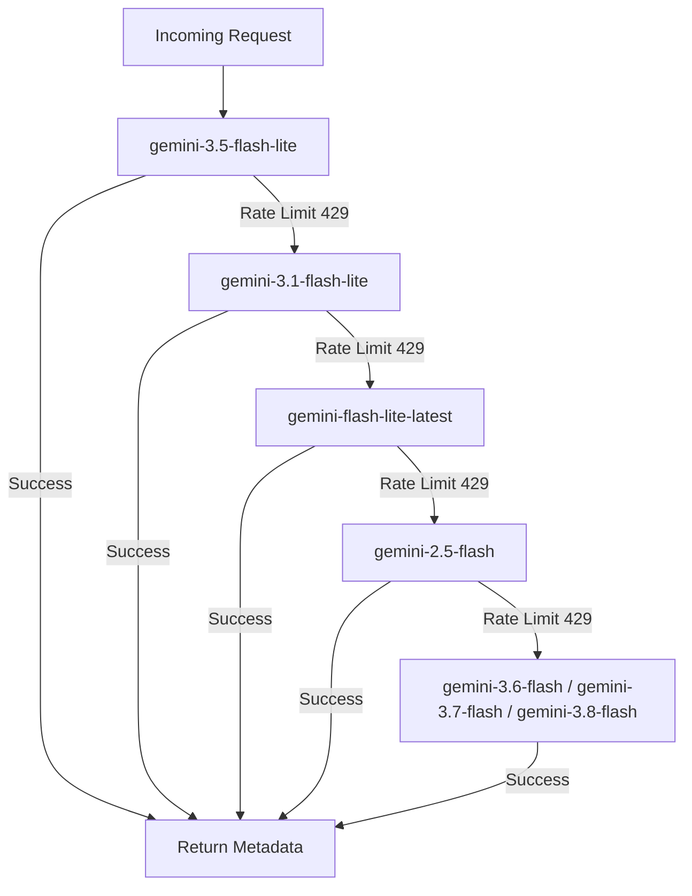

# 🚀 Jahan Ramesh - Next.js Developer Portfolio & AI-Powered CMS

> **A high-performance, full-stack personal portfolio and content management system** built for software engineers, IT professionals, and developers. Powered by **Next.js 14 (App Router)**, **React**, **Tailwind CSS**, **Firebase**, **Cloudinary**, and **Google Gemini AI**.

[](https://nextjs.org/)
[](https://react.dev/)
[](https://tailwindcss.com/)
[](https://firebase.google.com/)
[](https://cloudinary.com/)
[](https://ai.google.dev/)

---

## 📖 Table of Contents
- [💡 Project Overview & Core Vision](#-project-overview--core-vision)
- [✨ Public Portfolio Experience](#-public-portfolio-experience)
  - [1. Hero Section](#1-hero-section)
  - [2. About Me](#2-about-me)
  - [3. Services](#3-services)
  - [4. Dynamic Projects Showcase](#4-dynamic-projects-showcase)
  - [5. Technical & Professional Skills](#5-technical--professional-skills)
  - [6. Certifications & Credentials](#6-certifications--credentials)
  - [7. Verified Digital Badges & Micro-Credentials](#7-verified-digital-badges--micro-credentials)
  - [8. Contact & Social Ecosystem](#8-contact--social-ecosystem)
  - [9. Visitor Analytics & Tracking](#9-visitor-analytics--tracking)
- [🛡️ Private Admin CMS Dashboard](#️-private-admin-cms-dashboard)
  - [Authentication & Security](#authentication--security)
  - [Project Management & GitHub AI Auto-Fill](#project-management--github-ai-auto-fill)
  - [Certificate & Digital Badge CMS](#certificate--digital-badge-cms)
  - [Automatic Badge Icon Identification](#automatic-badge-icon-identification)
  - [Bulk Certificate Upload](#bulk-certificate-upload)
- [🧠 100% Free Gemini AI Auto-Fill Cascade](#-100-free-gemini-ai-auto-fill-cascade)
- [☁️ Cloudinary Media Architecture](#️-cloudinary-media-architecture)
- [📁 Project Architecture & Directory Structure](#-project-architecture--directory-structure)
- [⚙️ Environment Variables](#️-environment-variables)
- [🚀 Local Setup & Installation](#-local-setup--installation)
- [🔒 Firebase Rules & Configuration](#-firebase-rules--configuration)
- [🌐 Deployment (Vercel)](#-deployment-vercel)

---

## 💡 Project Overview & Core Vision

The purpose of this portfolio is to provide a **living, dynamic personal platform** that does not require redeploying code whenever new projects, certificates, or achievements are earned.

1. **Zero-Friction Public Access**: Visitors can explore projects, inspect credentials, view high-resolution PDF certificates, and verify open badges in real-time with ultra-fast page speeds.
2. **Dynamic Cloud-Backed CMS**: All portfolio content is managed via a private, secured admin console backed by Firebase Firestore and Cloudinary CDN.
3. **AI-Assisted Administration**: Integrated with Google Gemini AI to eliminate manual data entry. Admins can paste a GitHub repository link or certificate document to auto-fill metadata in seconds.
4. **Separation of Certifications & Digital Badges**:
   - Traditional academic & corporate **Certificates** (PDFs/diplomas) with full-screen zoomable reader.
   - Standards-compliant **Digital Badges** (Open Badges v2, Parchment, Credly) with official badge artwork, assertion IDs, and verification registries.

---

## ✨ Public Portfolio Experience

### 1. Hero Section
- **Dynamic Typewriter Animation**: Cycles through technical roles (Software Engineer, Full Stack Developer, Cloud Enthusiast, UI/UX Designer).
- **Floating Profile Visual**: High-resolution profile avatar with ambient glow effects and hover dynamics.
- **Direct Resume Download**: 1-click CV access fetching the latest resume file.
- **Social Ecosystem**: Quick access buttons to GitHub, LinkedIn, HackerRank, Stack Overflow, YouTube, Discord, Twitter/X, Instagram, and Facebook.

### 2. About Me
- **Professional Biography**: Executive summary of background, engineering philosophy, and career objectives.
- **Structured Skill Stacks**: Categorized tech stacks highlighting Frontend, Backend, Database, and Cloud/DevOps competencies.

### 3. Services
- Interactive service cards for **Web Development**, **Mobile Application Development**, and **UI/UX Design**.
- Highlighting core methodologies, tech stacks, and modern design principles.

### 4. Dynamic Projects Showcase
- **Real-Time Synchronization**: Connects to Firestore to stream published projects instantaneously.
- **Featured Projects Grid**: Highlights marquee projects with large-format previews and prominent action links.
- **Category Filters**: Filter projects on the fly (*All*, *Web App*, *Mobile App*, *Mobile Game*, *AI / ML*, *UI/UX*).
- **Interactive Action Buttons**:
  - Live Demo / Preview link.
  - Source Code / GitHub repository link.
  - Technology stack pill tags.

### 5. Technical & Professional Skills
- **Technical Skills**: Animated progress bars showing proficiency in JavaScript, TypeScript, React, Next.js, Node.js, Python, Java, SQL, and Cloud platforms.
- **Professional Competencies**: SVG circular score meters representing problem-solving, project management, agile workflow, and teamwork.

### 6. Certifications & Credentials
- **Document Previews**: Renders certificate documents uploaded as PDF or images (auto-converted to crisp JPGs via Cloudinary).
- **Category Navigation**: Filter certificates by domain (*Web Development*, *Cloud & DevOps*, *AI / ML*, *Cybersecurity*, *UI/UX*, *Data Science*, *Database*).
- **Certificate Viewer Modal**:
  - Full-resolution document rendering.
  - Interactive Zoom Controls: Zoom in up to 250%, zoom out to 75%, and 1-click reset to 100%.
  - Open PDF in full-screen new tab.
  - Direct 1-click download with proper file naming.
  - Credential ID display and external verification button.

### 7. Verified Digital Badges & Micro-Credentials
- **Dedicated Section**: Positioned directly below traditional certificates to highlight modern micro-credentials.
- **Open Badges Display**:
  - Badge cards featuring a circular glowing pedestal framing the official badge icon.
  - Issuer name with verified shield checkmark.
  - Issue date and achievement description.
- **Interactive Badge Viewer Modal**:
  - High-resolution badge artwork with drop shadow.
  - Verified micro-credential tag.
  - 1-click copy for Assertion / Credential IDs with visual "Copied!" feedback.
  - Direct verification button navigating to the official registry (Parchment, Credly, Badgr).

### 8. Contact & Social Ecosystem
- **Interactive Contact Form**: Integrated with EmailJS for direct inbox message delivery.
- Input validation, loading indicators, and toast notification alerts.
- Direct contact cards (email, phone, location, availability status).

### 9. Visitor Analytics & Tracking
- **Automatic Background Tracker**: Logs page visits, country, device type (Desktop, Mobile, Tablet), browser, and operating system without slowing down client page loads.
- Data stored directly in Firestore for analysis in the admin dashboard.

---

## 🛡️ Private Admin CMS Dashboard

Access the secured dashboard at `/admin/dashboard` (login portal at `/admin/login`).

### Authentication & Security
- Guarded by Firebase Authentication.
- All non-authenticated attempts to access `/admin/dashboard` are automatically intercepted and redirected to `/admin/login`.
- No public registration: admin accounts are created securely inside the Firebase Console.

### Project Management & GitHub AI Auto-Fill
- **Create & Edit Projects**: Title, category, summary, description, tech stack tags, demo link, GitHub link, display order, and featured toggle.
- **✨ GitHub AI Auto-Fill Engine**:
  - Paste any GitHub repository URL (e.g. `https://github.com/user/project`).
  - Google Gemini AI fetches repository metadata, reads the `README.md`, analyzes language distributions, and auto-populates all form fields.
- **Instant Status Toggle**: Switch any project between *Published* and *Draft* with a single click.

### Certificate & Digital Badge CMS
- **Format Toggle**: Explicitly select between:
  - **📜 Standard Certificate**: For traditional PDF diplomas, certificates of completion, and document scans.
  - **🛡️ Digital Badge**: For Open Badges and micro-credentials.
- **Input Modes**:
  1. **Upload File**: Upload PDF or image documents directly; uploaded to Cloudinary with automatic high-res preview generation.
  2. **Verification Link**: Paste a verification link from Parchment, Credly, Coursera, Udemy, etc.
  3. **Direct URL**: Enter an existing image or document URL.

### Automatic Badge Icon Identification
- **Parchment / Badgr Open Badges v2 Integration**:
  - Paste any assertion URL (e.g. `https://badges.parchment.com/public/assertions/N6taIz2BSt2B55ZiwBooXw`).
  - The API requests the assertion JSON, extracts the badge class, issuer (*Postman*), recipient, criteria, and **badge icon PNG**.
  - Automatically rehosts the badge icon to Cloudinary for permanent, fast CDN delivery.
- **Credly Integration**: Auto-extracts OpenGraph badge icons and credential details.

### Bulk Certificate Upload
- Upload 5, 10, or 20+ certificates at once.
- Drag-and-drop batch upload modal with individual progress indicators and automatic multi-file AI extraction.

---

## 🧠 100% Free Gemini AI Auto-Fill Cascade

Both `/api/extract-certificate` and `/api/extract-github-project` utilize a multi-tier fallback cascade designed to operate entirely within Google's **100% Free API Tier**:



- **Silent Fallback**: When daily or per-minute rate limits (RPM / RPD) are reached on one model, the system immediately switches to the next free model.
- **Clean UI Feedback**: Erroneous "check your plan and billing details" messages are suppressed and never shown to the admin user.
- **Key Redundancy**: Supports comma-separated keys (`GEMINI_API_KEYS=key1,key2,key3`) for rotation across multiple keys.

---

## ☁️ Cloudinary Media Architecture

All media assets are optimized through Cloudinary:
- **PDF-to-Image Generation**: For any uploaded certificate PDF, Cloudinary automatically renders an ultra-crisp JPG preview for instant browser display (`/image/upload/q_auto,f_auto,w_1800/`).
- **Badge Icon Rehosting**: Transparent PNG badge artwork from third-party issuers is permanently stored in the `portfolio-certificates` Cloudinary folder.
- **Fast Global CDN**: Low-latency content delivery across all visitor regions.

---

## 📁 Project Architecture & Directory Structure

```
├── public/
│   ├── assets/
│   │   ├── images/               # Static portfolio imagery & assets
│   │   └── cv/                   # Downloadable CV PDF files
│   └── favicon.ico
├── src/
│   ├── app/
│   │   ├── admin/
│   │   │   ├── login/page.jsx    # Secure admin authentication screen
│   │   │   └── dashboard/page.jsx# Main CMS control panel
│   │   ├── api/
│   │   │   ├── extract-certificate/route.js    # AI document + Open Badges URL parser
│   │   │   ├── extract-github-project/route.js # AI GitHub repo inspector
│   │   │   └── track-visitor/route.js          # Analytics logging endpoint
│   │   ├── globals.css           # Tailwind base styles and theme variables
│   │   ├── layout.jsx            # Global layout, meta tags, and visitor tracker
│   │   ├── page.jsx              # Main public portfolio page
│   │   ├── robots.js             # Automated robots.txt
│   │   └── sitemap.js            # Dynamic XML sitemap generator
│   ├── components/
│   │   ├── Navbar.jsx            # Header navigation & quick resume trigger
│   │   ├── Hero.jsx              # Animated hero section with typewriter
│   │   ├── About.jsx             # About me bio & categorized tech stacks
│   │   ├── Services.jsx          # Services showcase grid
│   │   ├── Projects.jsx          # Projects grid with category tabs
│   │   ├── ProjectCard.jsx       # Individual project card with action buttons
│   │   ├── Skills.jsx            # Progress bars & circular indicators
│   │   ├── Certificates.jsx      # Certificates + Verified Digital Badges
│   │   ├── Contact.jsx           # Contact form powered by EmailJS
│   │   ├── Footer.jsx            # Footer links & copyright
│   │   ├── ThemeToggle.jsx       # Dark / Light theme toggle
│   │   ├── Toast.jsx             # Global alert toast system
│   │   ├── VisitorTracker.jsx    # Client-side analytics trigger
│   │   └── admin/
│   │       ├── Sidebar.jsx                   # Admin navigation sidebar
│   │       ├── DashboardStats.jsx            # Metrics overview cards
│   │       ├── ProjectTable.jsx              # Projects management table
│   │       ├── ProjectFormModal.jsx          # Project editor with AI autofill
│   │       ├── CertificateTable.jsx          # Certificates/Badges list with filters
│   │       ├── CertificateFormModal.jsx      # Certificate editor with badge preview
│   │       ├── BulkCertificateUploadModal.jsx# Multi-file batch uploader
│   │       ├── VisitorAnalyticsTable.jsx     # Traffic logs viewer
│   │       └── DeleteConfirmModal.jsx        # Confirmation dialogs
│   └── lib/
│       ├── firebase.js           # Firebase app initialization
│       ├── auth.js               # Firebase authentication helpers
│       ├── firestore.js          # Real-time Firestore queries & CRUD
│       ├── storage.js            # Storage upload utility
│       ├── downloadHelper.js     # Direct PDF/image download utilities
│       └── initialProjects.js    # Default seed data
├── .env                          # Local environment variables
├── .env.example                  # Template configuration file
├── firestore.rules               # Production Firestore database rules
├── storage.rules                 # Production Storage security rules
├── next.config.js
├── tailwind.config.js
└── package.json
```

---

## ⚙️ Environment Variables

Create a `.env` file in the root folder with your credentials (see [.env.example](./.env.example)):

```bash
# ==========================================
# Firebase Web Client Configuration
# ==========================================
NEXT_PUBLIC_FIREBASE_API_KEY=your_firebase_api_key
NEXT_PUBLIC_FIREBASE_AUTH_DOMAIN=your_project.firebaseapp.com
NEXT_PUBLIC_FIREBASE_PROJECT_ID=your_project_id
NEXT_PUBLIC_FIREBASE_STORAGE_BUCKET=your_project.firebasestorage.app
NEXT_PUBLIC_FIREBASE_MESSAGING_SENDER_ID=your_messaging_sender_id
NEXT_PUBLIC_FIREBASE_APP_ID=your_firebase_app_id
NEXT_PUBLIC_FIREBASE_MEASUREMENT_ID=your_measurement_id

# ==========================================
# EmailJS Configuration (Contact Form)
# ==========================================
NEXT_PUBLIC_EMAILJS_PUBLIC_KEY=your_emailjs_public_key
NEXT_PUBLIC_EMAILJS_SERVICE_ID=your_emailjs_service_id
NEXT_PUBLIC_EMAILJS_TEMPLATE_ID=your_emailjs_template_id

# ==========================================
# Cloudinary Configuration (PDFs & Badge Icons)
# ==========================================
CLOUDINARY_URL=cloudinary://<api_key>:<api_secret>@<cloud_name>

# ==========================================
# Google Gemini API (100% Free AI Auto-Fill Engine)
# ==========================================
GEMINI_API_KEY=your_primary_gemini_api_key
GEMINI_BACKUP_KEY=your_backup_gemini_api_key
GEMINI_API_KEYS=key1,key2,key3
```

---

## 🚀 Local Setup & Installation

### 1. Clone & Install
```bash
git clone https://github.com/JahanRazh/Jahan-sportfolio-website.git
cd Jahan-sportfolio-website
npm install
```

### 2. Run the Development Server
```bash
npm run dev
```
Open [http://localhost:3000](http://localhost:3000) to view the live portfolio.
Access the Admin CMS at [http://localhost:3000/admin/login](http://localhost:3000/admin/login).

### 3. Production Build & Test
```bash
npm run build
npm run start
```

---

## 🔒 Firebase Rules & Configuration

Deploy the following rules in **Firebase Console** -> **Firestore Database** -> **Rules**:

```javascript
rules_version = '2';
service cloud.firestore {
  match /databases/{database}/documents {
    function isAuthenticated() {
      return request.auth != null;
    }

    // Projects: Public read for published, authenticated write
    match /projects/{projectId} {
      allow read: if resource.data.published == true || isAuthenticated();
      allow create, update, delete: if isAuthenticated();
    }

    // Certificates & Digital Badges: Public read for published, authenticated write
    match /certificates/{certId} {
      allow read: if resource.data.published == true || isAuthenticated();
      allow create, update, delete: if isAuthenticated();
    }

    // Profile & Settings
    match /profile/{docId} {
      allow read: if true;
      allow write: if isAuthenticated();
    }

    // Visitor tracking: Anyone can write an event, only admin can read
    match /visitors/{visitorId} {
      allow create: if true;
      allow read, update, delete: if isAuthenticated();
    }
  }
}
```

---

## 🌐 Deployment (Vercel)

1. Push your code to GitHub:
   ```bash
   git add .
   git commit -m "feat: complete next.js portfolio with digital badges and AI autofill"
   git push origin main
   ```
2. Import the repository into [Vercel](https://vercel.com/).
3. Add all variables from `.env` in the **Environment Variables** panel.
4. Click **Deploy**.
5. **Whitelist your domain in Firebase**:
   - Go to **Firebase Console** -> **Authentication** -> **Settings** -> **Authorized domains**.
   - Add your Vercel deployment URL (e.g. `your-portfolio.vercel.app`).

---

## 👨‍💻 Author & Connect

**Ramesh Jahan Jayalath**
- **Portfolio**: [Live Website](http://localhost:3000)
- **LinkedIn**: [Jahan Jayalath](https://www.linkedin.com/in/jahan-jayalath-08a73528b/)
- **GitHub**: [@JahanRazh](https://github.com/JahanRazh)
- **Email**: contact@jahanjayalath.com

---

## 📄 License
This project is open-source and available under the [MIT License](LICENSE).
